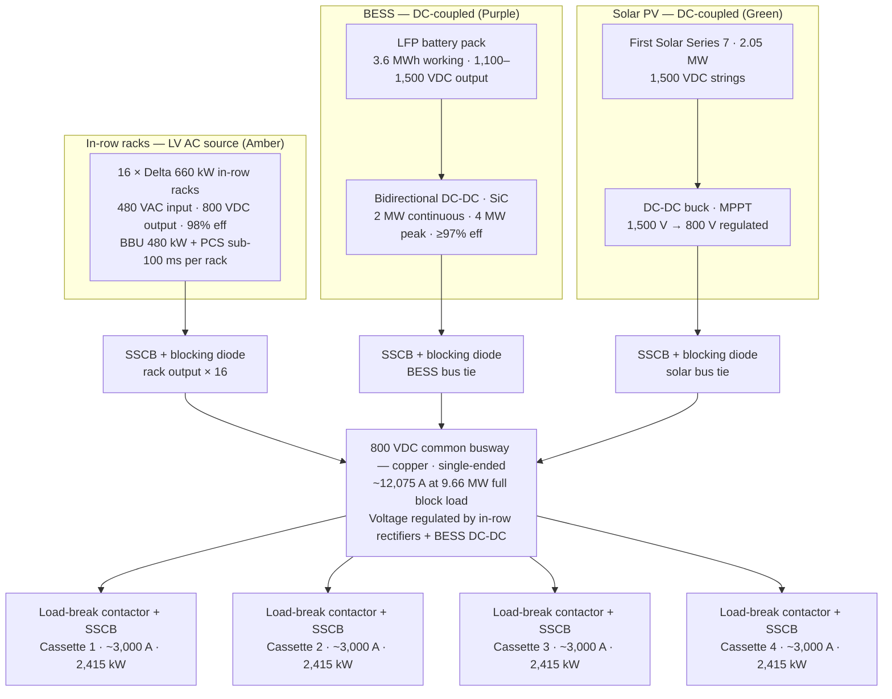
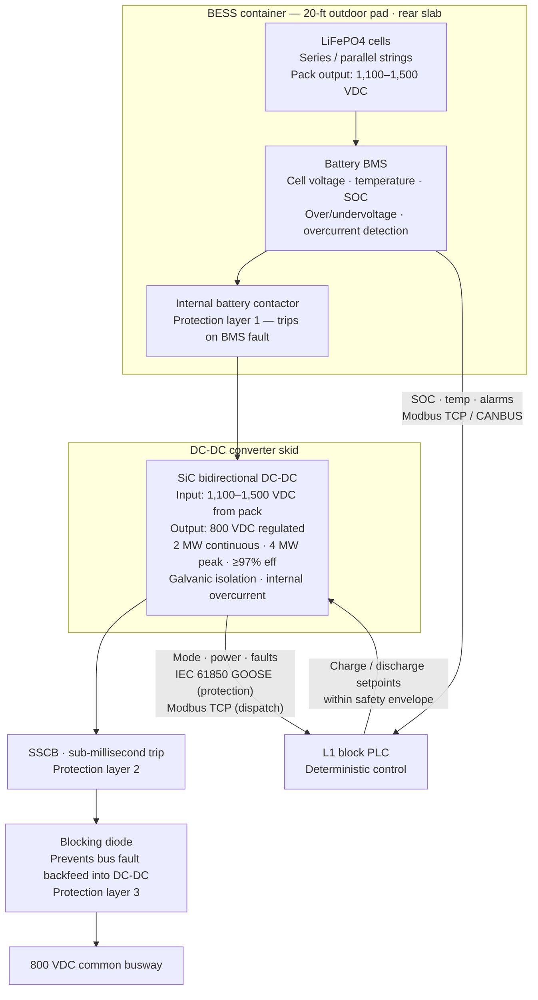
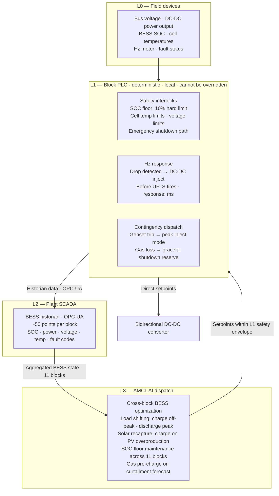
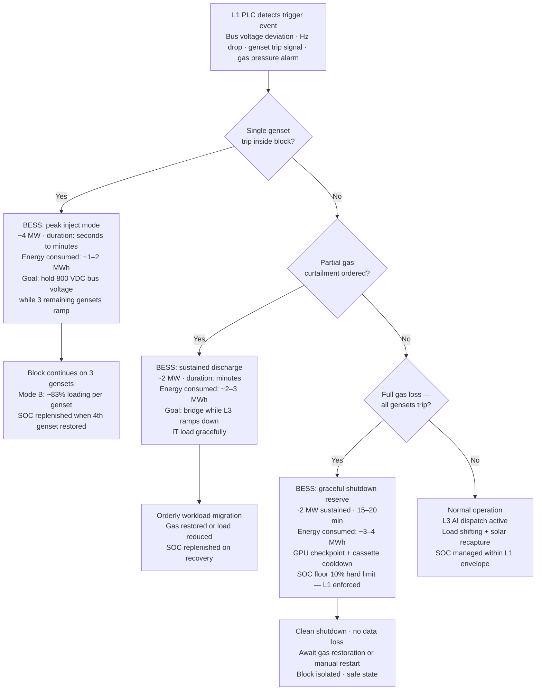
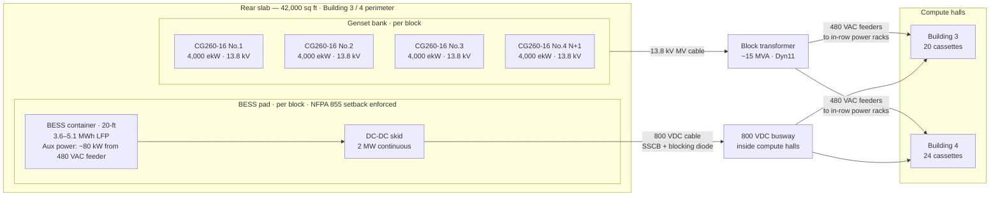

# ST-TRAP-BESS-ARCHDIAG-001 — BESS Architecture Diagram Package — Rev 0.1

**Document:** BESS Architecture Diagram Package
**Project:** Trappey's AI Center, Lafayette, Louisiana
**Revision:** 0.1 — first issue; visual companion to ST-TRAP-BESS-001 Rev 0.1
**Date:** April 17, 2026
**Owner:** Scott Tomsu
**Status:** Working draft — diagrams rendered as Mermaid (inline). Polished PDF/Word export targets Rev 1.0.

---

## 1. Purpose

Visual companion to ST-TRAP-BESS-001 Rev 0.1. Captures the BESS topology for one Marlie-pattern block at Trappey's — from the LFP battery pack through the bidirectional DC-DC converter to the 800 VDC common busway, with AMCL dispatch architecture and contingency scenario logic.

Five diagrams: one 800 VDC bus overview (block scope), one BESS DC stack zoom, one AMCL dispatch hierarchy, one contingency decision tree, and one rear slab physical layout.

**This package is architectural, not construction-issue.** CT designations, cable sizing, SSCB ratings, and trip coordination belong in ST-TRAP-SLD-001 and ST-TRAP-PROT-001. Those documents inherit the topology shown here.

**Rendering:** Diagrams use Mermaid flowchart syntax. Renders natively in VS Code (Mermaid extension), GitHub markdown preview, and Notion. For external distribution, export to PDF via VS Code Mermaid export or equivalent before Rev 1.0.

## 2. Relationship to other documents

**Upstream (this package inherits from):**

- BESS-001 Rev 0.1 — architecture anchor for this diagram package
- ELEC-001 Rev 1.2 — block electrical architecture; BESS sizing and coupling in §8
- BOD-001 Rev 0.4 — ledger authority; E-10 through E-13
- ARCHDIAG-001 Rev 0.1 — Diagram 4 shows BESS on 800 VDC bus at block scope

**Downstream (inherits from this package):**

- ST-TRAP-SLD-001 — formal single-line with BESS tie conductor sizing and SSCB ratings
- ST-TRAP-PROT-001 — DC protection coordination at BESS bus tie; SSCB pickup settings
- ST-TRAP-BESS-RFQ-001 — vendor procurement package (not yet drafted)

## 3. Conventions — domain color coding

Consistent with ARCHDIAG-001 Rev 0.1.

| Color | Domain | Elements |
|---|---|---|
| Amber | LV AC (480 V) | In-row rack AC input, BESS aux feed |
| Teal | 800 VDC | Common busway, SSCBs, blocking diodes, cassette umbilicals |
| Purple | BESS | LFP battery pack, BMS, bidirectional DC-DC, protection chain |
| Green | Solar / PV | First Solar array, DC-DC buck |
| Pink | Controls | AMCL tiers, L1 PLC, L2 SCADA, L3 AI dispatch |

*Mermaid does not apply color coding natively in all renderers. Color is noted in diagram titles and node labels.*

---

## 4. Diagram 1 — 800 VDC bus: three DC sources (block scope)

Three DC sources converge on the 800 VDC common busway for one block. In-row rack rectifier output, DC-coupled BESS via bidirectional DC-DC, and DC-coupled solar via DC-DC buck each connect through a dedicated SSCB and blocking diode. Four cassette umbilicals exit via load-break contactors and SSCBs. Bus current ~12,075 A at full block load (9,660,000 W ÷ 800 V).

---

## 5. Diagram 2 — BESS DC stack: battery pack to bus

Zoom into the BESS source. LFP cells → BMS → internal battery contactor → bidirectional DC-DC → SSCB → blocking diode → 800 VDC bus. Three-layer protection hierarchy. Communication paths to L1 block PLC shown with protocol callouts.

---

## 6. Diagram 3 — AMCL BESS dispatch: L1 deterministic and L3 AI

Two-tier dispatch. L1 block PLC holds all safety interlocks — SOC floor, temperature, cell voltage limits — and cannot be overridden by L3. L3 AMCL AI optimizes across all 11 blocks within the L1 safety envelope. Setpoints flow L3 → L1 → DC-DC. Protection trips flow DC-DC → L1 → local action, no L3 involvement.

---

## 7. Diagram 4 — Contingency scenario decision tree

L1 PLC detects a trigger event and dispatches BESS accordingly. Three branches cover the full contingency envelope defined in BESS-001 §6. Energy values bound the 3–5 MWh per-block sizing envelope. SOC floor (10%) is a hard limit enforced by L1 — cannot be discharged below this regardless of L3 command.

---

## 8. Diagram 5 — Physical installation: rear slab layout

One block shown. Eleven identical block footprints on the 42,000 sq ft rear slab behind Buildings 3 and 4. BESS containers subject to NFPA 855 (2026) setback distances from gensets, gas lines, property lines, and compute hall walls. Setback distances to be confirmed with Lafayette Parish AHJ at pre-application meeting.

---

## 9. Engineering notes

### 9.1 What these diagrams lock

- DC coupling path: battery pack → bidirectional DC-DC → SSCB → blocking diode → 800 VDC bus. This topology is locked (BOD-001 E-11, E-12).
- Three-layer DC protection hierarchy: BMS contactor (L1) → DC-DC internal (L2) → SSCB (L3) → blocking diode (L4). Coordination logic flows to PROT-001.
- Two-tier AMCL dispatch: L1 holds all safety interlocks; L3 optimizes within envelope. L1 cannot be overridden by L3 on any safety parameter.
- Three contingency scenarios bound the 3–5 MWh per-block sizing envelope.

### 9.2 What these diagrams do not lock

- BESS container vendor (Saft / LG ES Vertech / Fluence) — open pending RFQ (E-13)
- Bidirectional DC-DC vendor (integrated with BESS vs. Hitachi AMPS standalone) — open pending RFQ (E-12)
- SSCB ratings, cable sizing, coordination intervals — belong in SLD-001 and PROT-001
- Rear slab setback distances — require NFPA 855 (2026) AHJ interpretation and physical layout study
- LG ES Vertech JF2 DC LINK is 23 ft wide (non-standard ISO) — pad logistics and crane requirements require confirmation before that vendor is selected

### 9.3 Mermaid rendering notes

These diagrams are working-draft architectural representations. Mermaid flowchart does not produce IEC 60617-compliant symbols or IEEE Std 315 one-line annotations — those belong in ST-TRAP-SLD-001 (formal single-line, not yet drafted). Mermaid topology correctly represents source-to-load paths, protection insertion points, and control signal routing.

For Rev 1.0 external distribution: export diagrams from VS Code Mermaid Preview (SVG or PNG), embed in the companion Word/PDF document, and archive alongside the markdown source.

---

## 10. Open items

| Ref | Item | Blocked on | Priority |
|---|---|---|---|
| E-12 | DC-DC vendor — integrated with BESS pack or Hitachi AMPS standalone | BESS RFQ | C1 |
| E-13 | BESS container vendor — Saft / LG ES Vertech / Fluence | BESS RFQ | C1 |
| PROT | DC protection coordination — SSCB ratings, blocking diode spec, BMS contactor coordination | ST-TRAP-PROT-001 | C1 |
| NFPA | NFPA 855 (2026) setback distances — Lafayette Parish AHJ interpretation | AHJ pre-application | C1 |
| PHYS | Rear slab layout study — BESS container setbacks vs genset placement and gas lines | Physical layout study | C2 |
| RENDER | Rev 1.0 diagram export — Mermaid → SVG/PNG for external distribution | Internal | C2 |

---

## 11. Revision plan

- **Rev 0.1 (current)** — first issue. Five Mermaid diagrams. Companion to BESS-001 Rev 0.1, ELEC-001 Rev 1.2, BOD-001 Rev 0.4.
- **Rev 0.2** — after Cat CSA governor data returns. Updates contingency scenario energy values in Diagram 4 if sizing envelope shifts.
- **Rev 0.3** — after BESS RFQ closes. Updates Diagrams 2 and 5 with locked vendor, container dimensions, and DC-DC skid configuration. Adds vendor-specific protection callouts to Diagram 2.
- **Rev 0.4** — after PROT-001 completes. Updates Diagram 2 with locked SSCB ratings and blocking diode spec.
- **Rev 1.0** — ready for external circulation. Mermaid diagrams exported to SVG/PNG. All C1 items closed. Paired with SLD-001 Rev 1.0 and PROT-001 Rev 1.0.

## 12. Approval

Rev 0.1 does not carry external circulation approval. Architecture inherits from BESS-001 Rev 0.1 and ELEC-001 Rev 1.2 approval status. External distribution waits for Rev 1.0, gated on all C1 items per §10.

---

**End of ST-TRAP-BESS-ARCHDIAG-001 Rev 0.1.**
