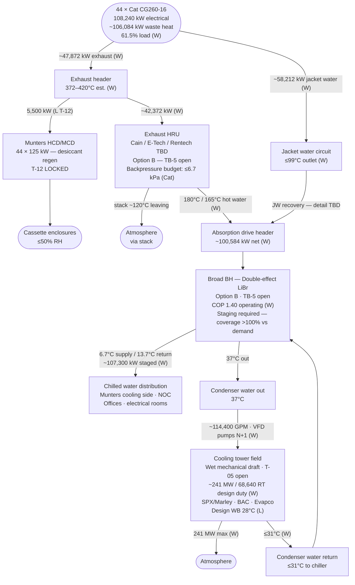
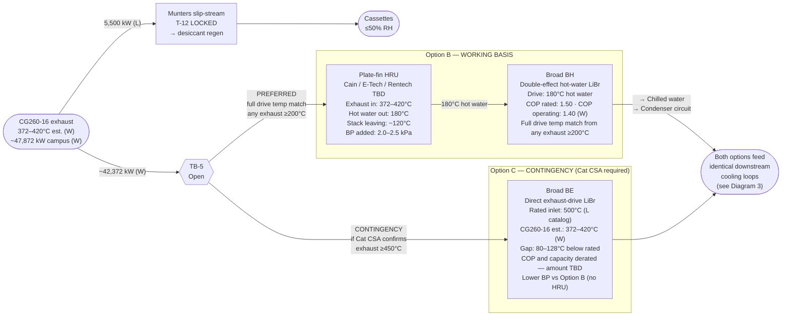
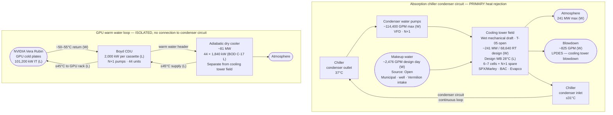

# ST-TRAP-CHP-SCHEMATIC-001 — CHP Cascade Schematic — Rev 0.1

**Document:** CHP Thermal Cascade — End-to-End Schematic Package
**Project:** Trappey's AI Center, Lafayette, Louisiana
**Revision:** 0.1 — first issue
**Date:** April 18, 2026
**Owner:** Scott Tomsu
**Status:** Working draft
**Basis:** Option B (double-effect hot-water via HRU) — TB-5 open. Option C (direct exhaust to Broad BE) is the contingency; removing the HRU and substituting Broad BE for BH is the only topology change.
**Authority:** ST-TRAP-THERMAL-BASIS Rev 0.4 · ST-TRAP-COOLING-TOWER-001 Rev 0.1. No values originate here — this is a visual companion only.

W = Working estimate · L = Locked per BOD-001 · O = Open

---

## Diagram 1 — CHP Cascade: End-to-End Overview

Full thermal chain from genset combustion to atmospheric rejection. Condenser water return loop shown at bottom.

---

## Diagram 2 — Exhaust Path: Option B vs C Branch Point

TB-5 is the only structural topology decision in the CHP cascade. Everything downstream of the chiller is identical under both options.

---

## Diagram 3 — Cooling Water Loops

Two physically and thermally isolated circuits. No shared piping, no shared basin.

---

## Heat Balance Summary — Stage 1 Campus, Option B, 61.5% Load

| Stream | kW | Status | Disposition |
|---|---|---|---|
| Electrical generation (44 gensets) | 108,240 | W | IT + facility + aux |
| IT load (44 cassettes) | 101,200 | L | GPU compute |
| Facility aux (NOC, offices, controls) | ~6,100 | W | Facility load |
| **Total waste heat — exhaust + JW** | **~106,084** | **W** | → recovery cascade |
| Munters slip-stream (T-12 LOCKED) | 5,500 | L | → desiccant regen |
| Net to absorption chiller | ~100,584 | W | → Broad BH drive |
| Absorption COP (Option B, operating) | 1.40 | W | — |
| Absorption cooling produced (max) | ~140,818 | W | > campus demand |
| Campus cooling demand (IT + overhead) | ~107,300 | W | Staged chiller output |
| **Condenser + absorber rejection — nominal** | **~183,943** | **W** | → cooling towers |
| **Condenser + absorber rejection — maximum** | **~241,402** | **W** | → cooling towers (design sizing) |
| GPU warm water (Boyd CDU) | ~80,960 | L (C-17) | → adiabatic dry cooler (separate) |
| Stack exhaust (after HRU extraction) | TBD | O | → atmosphere via stack |
| Cooling tower makeup water | ~2,476 GPM | W | → evaporation + blowdown |

**Key: all campus cooling demand met by absorption cooling alone. No grid, no river, no auxiliary chiller required under Option B at 61.5% genset load.**

---

## Open Items Blocking Schematic Lock

| Ref | Impact on this document |
|---|---|
| TB-5 | Determines Diagram 2 branch — Option B or C. Until resolved, Option B is the working schematic. |
| Cat CSA | Confirms CG260-16 exhaust temperature and mass flow at 61.5% load — locks heat balance numbers. |
| JW integration detail | How jacket water heat interfaces with absorption drive (direct header supplement vs separate PHE cascade vs separate single-effect stage). |
| T-05 | Cooling tower type selection — locks tower specification in Diagrams 1 and 3. |
| COND-WB | Broad app eng confirmation on 31°C condenser water inlet — locks condenser water supply temperature in Diagram 3. |

---

## Revision Plan

| Rev | Trigger | Change |
|---|---|---|
| **0.1 (current)** | First issue | Full cascade overview, Option B/C branch, cooling loop isolation, heat balance table |
| 0.2 | TB-5 closes | Diagram 2 — remove contingency branch, lock working option; update chiller label with confirmed model |
| 0.3 | Cat CSA received | Update all W heat balance values with confirmed genset data |
| 1.0 | All C1 items closed | Lock schematic. Paired with THERMAL-BASIS Rev 1.0 and COOLING-TOWER-001 Rev 1.0 |

---

## Approval

Rev 0.1 is a working draft for internal engineering use. Not for external distribution. Sign-off follows BOD-001 Rev 0.4 approval path. External distribution waits for Rev 1.0.

---

**End of ST-TRAP-CHP-SCHEMATIC-001 Rev 0.1.**
