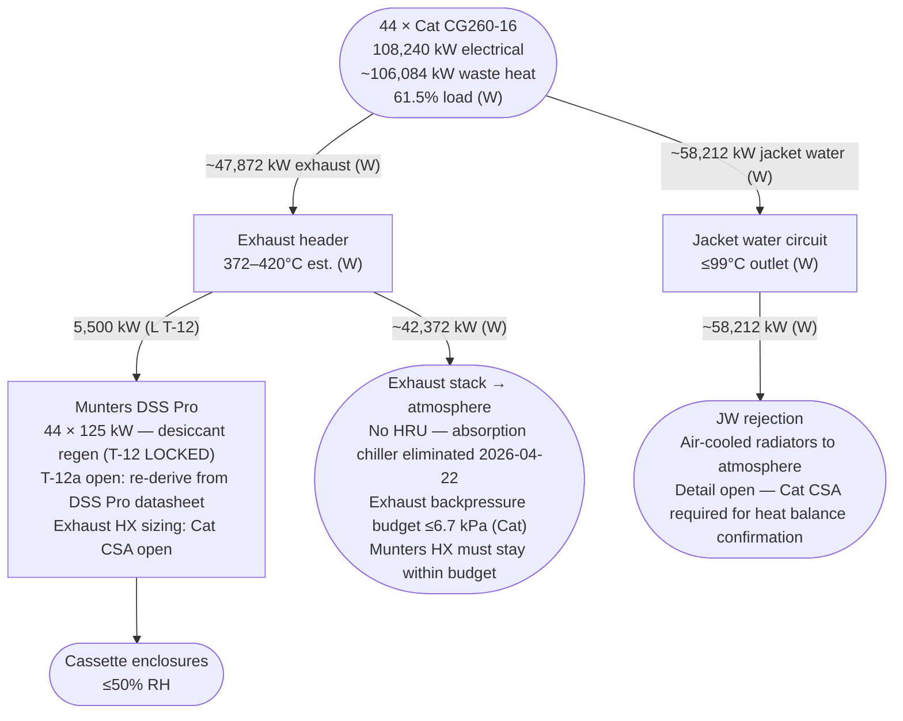
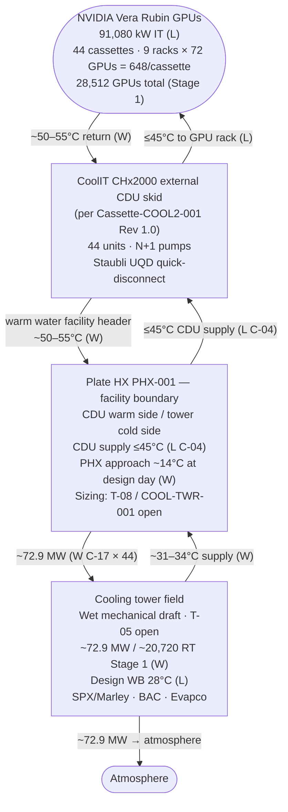

# ST-TRAP-CHP-SCHEMATIC-001 — CHP Cascade Schematic — Rev 0.3

**Document:** CHP Thermal Cascade — End-to-End Schematic Package
**Project:** Trappey's AI Center, Lafayette, Louisiana
**Revision:** 0.3 — Stage 1 IT rebased to 91.1 MW per BOD Rev 0.6; CDU updated to CoolIT CHx2000; cooling tower duty rebased to ~72.9 MW; GPU count corrected to 648/cassette
**Date:** April 23, 2026
**Owner:** Scott Tomsu
**Status:** Working draft
**Basis:** CHP exhaust → Munters DSS Pro dehumidification regen only (T-12 LOCKED). Absorption chiller eliminated 2026-04-22. GPU warm water rejected via plate HX to cooling towers. No HRU. No LiBr chiller.
**Authority:** TRAP-BOD-001 Rev 0.6 · ST-TRAP-THERMAL-BASIS Rev 0.6 · ST-TRAP-COOLING-TOWER-001 Rev 0.3. No values originate here — this is a visual companion only.

W = Working estimate · L = Locked per BOD-001 · O = Open

---

## Revision Log

| Rev | Date | Changes |
|---|---|---|
| 0.1 | 2026-04-18 | First issue — Option B (exhaust HRU + Broad BH double-effect LiBr) as working basis |
| **0.2** | **2026-04-22** | **Absorption chiller eliminated. CHP exhaust → Munters only (T-12 LOCKED). Diagrams 1 and 2 rewritten. Heat balance updated.** |
| **0.3** | **2026-04-23** | **IT load rebased to 91,080 kW (44 × 2,070 kW) per BOD Rev 0.6. GPU count corrected to 648/cassette (9 racks × 72 GPUs). CDU updated to CoolIT CHx2000 external CDU skid. Munters updated to DSS Pro. Tower duty rebased to ~72.9 MW / ~20,720 RT. Heat balance table updated.** |

---

## Diagram 1 — CHP Cascade: Exhaust and Jacket Water Disposition

CHP waste heat is single-path: the Munters DSS Pro slip-stream draws 5,500 kW from the exhaust header (T-12 LOCKED). All remaining exhaust heat and all jacket water heat reject to atmosphere. No heat recovery unit. No absorption chiller.

---

## Diagram 2 — GPU Warm Water Loop: Cassette → Plate HX → Cooling Towers

GPU warm water is the sole cooling tower load. The plate HX is the facility boundary between the CDU circuit and the cooling tower circuit. No connection to CHP.

---

## Heat Balance Summary — Stage 1 Campus, 61.5% Load

| Stream | kW | Status | Disposition |
|---|---|---|---|
| Electrical generation (44 gensets) | 108,240 | W | IT + facility + aux |
| IT load (44 cassettes) | **91,080** | L | GPU compute |
| Facility aux (NOC, offices, controls) | ~6,100 | W | Facility load |
| Load margin at 61.5% | **+2,300 to +4,300** | W | Positive |
| **Total waste heat — exhaust + JW** | **~106,084** | **W** | See below |
| Munters DSS Pro slip-stream (T-12 LOCKED — sole CHP load) | 5,500 | L | → desiccant regen in cassettes |
| Remaining exhaust heat | ~42,372 | W | → stack to atmosphere |
| Jacket water heat | ~58,212 | W | → JW radiators to atmosphere |
| **GPU warm water (CoolIT CHx2000 CDU — cassette secondary)** | **~72,864** | **W (C-17)** | **→ plate HX PHX-001 → cooling towers → atmosphere** |

Key: Cooling towers serve GPU warm water only (~72.9 MW Stage 1). CHP exhaust → Munters DSS Pro only. No absorption chiller. No CHW distribution from CHP.

Note: Genset waste heat (~106 MW) exceeds the GPU warm water load (~72.9 MW) because genset waste heat is additional to the IT electrical energy — two separate heat streams.

---

## Open Items Blocking Schematic Lock

| Ref | Impact on this document |
|---|---|
| Cat CSA | Confirms CG260-16 exhaust temperature and mass flow at 61.5% load — locks Munters DSS Pro exhaust HX sizing in Diagram 1; confirms JW rejection method |
| T-12a | Munters DSS Pro regen reconciliation — 125 kW/cassette inherited from HCD/MCD; re-derive from DSS Pro datasheet |
| T-05 | Cooling tower type selection — locks tower label in Diagram 2 |
| T-08 | Tower field sizing confirmation — **~72.9 MW** rejection at 28°C WB; locks Diagram 2 tower duty |
| T-09 | Makeup water source — informational for Diagram 2 |

---

## Revision Plan

| Rev | Date | Changes |
|---|---|---|
| 0.1 | 2026-04-18 | First issue — full cascade with Option B/C absorption chiller (superseded 2026-04-22) |
| 0.2 | 2026-04-22 | Absorption chiller eliminated. CHP → Munters only. GPU warm water → plate HX → cooling towers. |
| **0.3 (current)** | **2026-04-23** | **IT load rebased to 91,080 kW; GPU count corrected to 648/cassette; CDU updated to CoolIT CHx2000; Munters updated to DSS Pro; tower duty rebased to ~72.9 MW / ~20,720 RT; heat balance table updated.** |
| 0.4 | Cat CSA received | Update Diagram 1 with confirmed exhaust temp/mass flow; T-12a resolved; lock heat balance W values |
| 1.0 | T-05, T-08, T-09 closed | Lock schematic. Paired with THERMAL-BASIS Rev 1.0 and COOLING-TOWER-001 Rev 1.0. |

---

## Approval

Rev 0.3 is a working draft for internal engineering use. Not for external distribution. Sign-off follows BOD-001 Rev 0.6 approval path.

---

**End of ST-TRAP-CHP-SCHEMATIC-001 Rev 0.3.**
