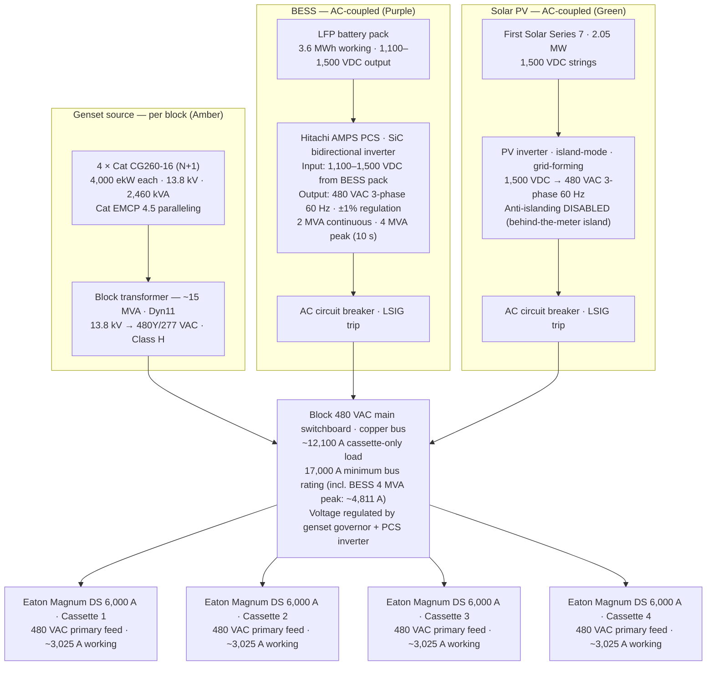
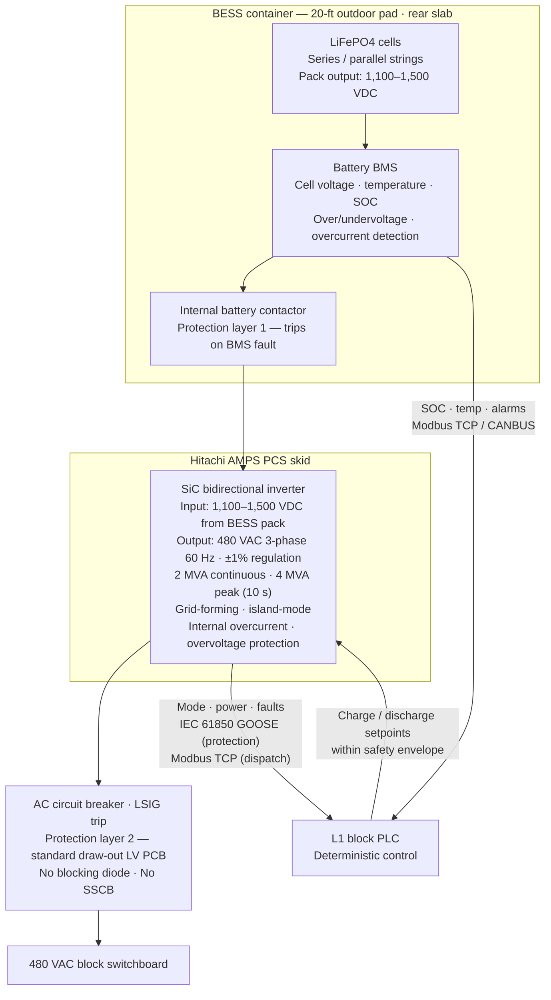
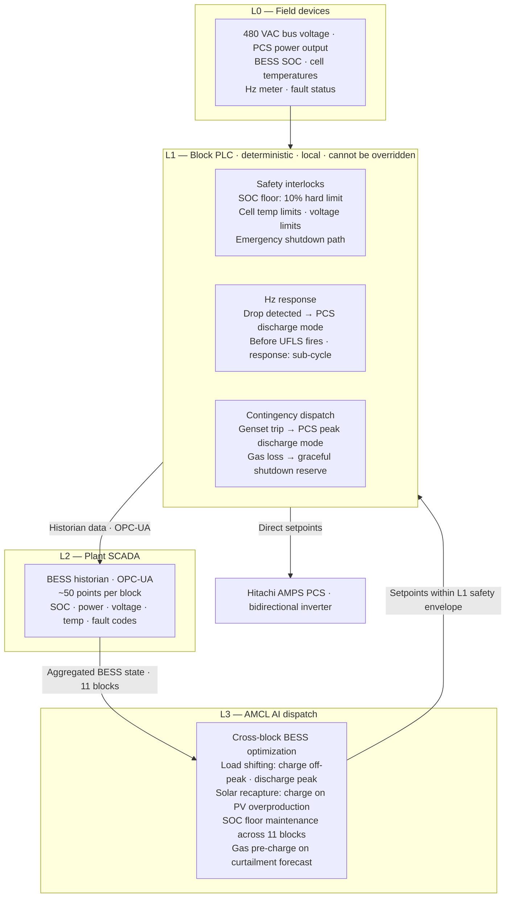
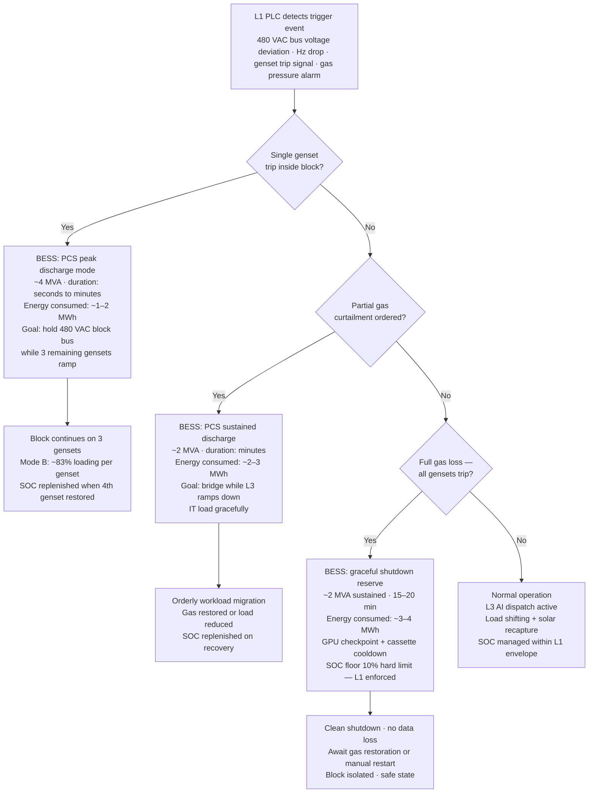
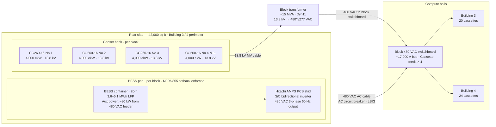

# ST-TRAP-BESS-ARCHDIAG-001 — BESS Architecture Diagram Package — Rev 0.2

**Document:** BESS Architecture Diagram Package
**Project:** Trappey's AI Center, Lafayette, Louisiana
**Revision:** 0.2 — AC coupling rewrite; five diagrams rebuilt for 480 VAC block bus topology; visual companion to ST-TRAP-BESS-001 Rev 0.2
**Date:** April 23, 2026
**Owner:** Scott Tomsu
**Status:** Working draft — diagrams rendered as Mermaid (inline). Polished PDF/Word export targets Rev 1.0.

---

## Revision Log

| Rev | Date | Changes |
|---|---|---|
| 0.1 | 2026-04-17 | First issue — five diagrams showing DC-coupled BESS on block-level 800 VDC bus. Companion to BESS-001 Rev 0.1. |
| **0.2** | **2026-04-23** | **All five diagrams rebuilt for AC-coupled 480 VAC topology per BOD-001 Rev 0.6 E-11/E-12. Diagram 1: block 480 VAC sources (genset transformer, BESS PCS, solar PV inverter) replacing block-level 800 VDC bus. Diagram 2: BESS pack → Hitachi AMPS PCS → AC breaker → 480 VAC switchboard replacing DC-DC → SSCB → blocking diode → 800 VDC bus. Diagrams 3–4: DC-DC inject mode → PCS discharge mode; 800 VDC bus → 480 VAC block bus. Diagram 5: DC-DC skid and 800 VDC bus cable removed; PCS skid → AC cable → 480 VAC switchboard.** |

---

## 1. Purpose

Visual companion to ST-TRAP-BESS-001 Rev 0.2. Captures the BESS topology for one four-cassette block at Trappey's — from the LFP battery pack through the Hitachi AMPS PCS bidirectional inverter to the 480 VAC block switchboard, with AMCL dispatch architecture and contingency scenario logic.

Five diagrams: one 480 VAC block bus overview (block scope), one BESS AC stack zoom, one AMCL dispatch hierarchy, one contingency decision tree, and one rear slab physical layout.

**This package is architectural, not construction-issue.** CT designations, cable sizing, breaker LSIG settings, and trip coordination belong in ST-TRAP-SLD-001 and ST-TRAP-PROT-001. Those documents inherit the topology shown here.

**Rendering:** Diagrams use Mermaid flowchart syntax. Renders natively in VS Code (Mermaid extension), GitHub markdown preview, and Notion. For external distribution, export to PDF via VS Code Mermaid export or equivalent before Rev 1.0.

## 2. Relationship to other documents

**Upstream (this package inherits from):**

- BESS-001 Rev 0.2 — architecture anchor for this diagram package
- ELEC-001 Rev 1.3 — block electrical architecture; BESS sizing and coupling in §8
- BOD-001 Rev 0.6 — ledger authority; E-10 through E-13
- TRAP-MASTER-ENG-001 Rev 0.4 — block 480 VAC bus structure; §4 BESS AC-coupled section

**Downstream (inherits from this package):**

- ST-TRAP-SLD-001 — formal single-line with PCS AC breaker conductor sizing and LSIG ratings
- ST-TRAP-PROT-001 — AC protection coordination at BESS bus tie; breaker pickup settings
- ST-TRAP-BESS-RFQ-001 Rev 0.2 — pending

## 3. Conventions — domain color coding

| Color | Domain | Elements |
|---|---|---|
| Amber | LV AC (480 V) | Block 480 VAC switchboard, cassette primary feeds, BESS PCS AC output, solar PV inverter output, genset transformer secondary |
| Teal | Cassette-internal 800 VDC | Delta in-row rack outputs, cassette 800 VDC internal busway — inside cassette envelope only; not a block-level bus |
| Purple | BESS | LFP battery pack, BMS, Hitachi AMPS PCS, AC circuit breaker |
| Green | Solar / PV | First Solar array, PV inverter |
| Pink | Controls | AMCL tiers, L1 PLC, L2 SCADA, L3 AI dispatch |

*Mermaid does not apply color coding natively in all renderers. Color is noted in diagram titles and node labels.*

---

## 4. Diagram 1 — 480 VAC block bus: three AC sources (block scope)

Three AC sources converge on the 480 VAC block switchboard for one block. Genset transformer secondary, BESS via Hitachi AMPS PCS, and solar PV inverter each connect through an AC circuit breaker. Four cassette primary feeds exit via Eaton Magnum DS 6,000 A disconnects. Bus current ~12,100 A cassette-only load (4 × ~3,025 A); bus rating 17,000 A minimum to accommodate BESS peak injection (~4,811 A at 4 MVA / 480 VAC) per MASTER-ENG §3.1.

**Note:** Delta in-row racks (R11–R15) are inside the cassette, downstream of the Eaton Magnum DS disconnect. They are not a block-bus source — they are a cassette-internal conversion stage from 480 VAC to 800 VDC internal bus. They do not appear on this block-scope diagram.

---

## 5. Diagram 2 — BESS AC stack: battery pack to 480 VAC switchboard

Zoom into the BESS source. LFP cells → BMS → internal battery contactor → Hitachi AMPS PCS bidirectional inverter → AC circuit breaker → 480 VAC block switchboard. Three-layer AC protection hierarchy. Communication paths to L1 block PLC shown with protocol callouts. No blocking diode. No SSCB. Standard AC protection gear throughout.

---

## 6. Diagram 3 — AMCL BESS dispatch: L1 deterministic and L3 AI

Two-tier dispatch. L1 block PLC holds all safety interlocks — SOC floor, temperature, cell voltage limits — and cannot be overridden by L3. L3 AMCL AI optimizes across all 11 blocks within the L1 safety envelope. Setpoints flow L3 → L1 → PCS. Protection trips flow PCS → L1 → local action, no L3 involvement.

---

## 7. Diagram 4 — Contingency scenario decision tree

L1 PLC detects a trigger event and dispatches BESS accordingly. Three branches cover the full contingency envelope defined in BESS-001 §6. Energy values bound the 3–5 MWh per-block sizing envelope. SOC floor (10%) is a hard limit enforced by L1 — cannot be discharged below this regardless of L3 command.

---

## 8. Diagram 5 — Physical installation: rear slab layout

One block shown. Eleven identical block footprints on the 42,000 sq ft rear slab behind Buildings 3 and 4. BESS containers subject to NFPA 855 (2026) setback distances from gensets, gas lines, property lines, and compute hall walls. Setback distances to be confirmed with Lafayette Parish AHJ at pre-application meeting.

---

## 9. Engineering notes

### 9.1 What these diagrams lock

- AC coupling path: battery pack → Hitachi AMPS PCS bidirectional inverter → AC circuit breaker → 480 VAC block switchboard. This topology is locked (BOD-001 E-11, E-12).
- Three-layer AC protection hierarchy: BMS contactor (L1) → PCS internal (L2) → AC circuit breaker (L3). No blocking diode. No SSCB at bus tie. Coordination logic flows to PROT-001.
- Two-tier AMCL dispatch: L1 holds all safety interlocks; L3 optimizes within envelope. L1 cannot be overridden by L3 on any safety parameter.
- Three contingency scenarios bound the 3–5 MWh per-block sizing envelope.
- Cassette-internal 800 VDC bus (Delta in-row racks R11–R15 to OCP ORV3 racks R1–R9) is inside the cassette envelope only. It does not appear in block-scope diagrams.

### 9.2 What these diagrams do not lock

- BESS container vendor (Saft / LG ES Vertech / Fluence) — open pending RFQ (E-13)
- PCS vendor (Hitachi AMPS PCS vs. integrated BESS+PCS system) — open pending RFQ (E-11/E-12)
- AC breaker ratings, cable sizing, coordination intervals — belong in SLD-001 and PROT-001
- Rear slab setback distances — require NFPA 855 (2026) AHJ interpretation and physical layout study
- LG ES Vertech JF2 DC LINK is 23 ft wide (non-standard ISO) — pad logistics and crane requirements require confirmation before that vendor is selected

### 9.3 Mermaid rendering notes

These diagrams are working-draft architectural representations. Mermaid flowchart does not produce IEC 60617-compliant symbols or IEEE Std 315 one-line annotations — those belong in ST-TRAP-SLD-001 (formal single-line, not yet drafted). Mermaid topology correctly represents source-to-load paths, protection insertion points, and control signal routing.

For Rev 1.0 external distribution: export diagrams from VS Code Mermaid Preview (SVG or PNG), embed in the companion Word/PDF document, and archive alongside the markdown source.

---

## 10. Open items

| Ref | Item | Blocked on | Priority |
|---|---|---|---|
| E-11 | Hitachi AMPS PCS vendor selection — standalone or integrated with BESS pack | BESS RFQ | C1 |
| E-12 | PCS island-mode confirmation — 480 VAC grid-forming at block bus | BESS RFQ vendor response | C1 |
| E-13 | BESS container vendor — Saft / LG ES Vertech / Fluence | BESS RFQ | C1 |
| PROT | AC protection coordination — PCS AC breaker LSIG settings, coordination with switchboard main | ST-TRAP-PROT-001 | C1 |
| NFPA | NFPA 855 (2026) setback distances — Lafayette Parish AHJ interpretation | AHJ pre-application | C1 |
| PHYS | Rear slab layout study — BESS container setbacks vs genset placement and gas lines | Physical layout study | C2 |
| RENDER | Rev 1.0 diagram export — Mermaid → SVG/PNG for external distribution | Internal | C2 |

---

## 11. Revision plan

- **Rev 0.1** (superseded) — first issue. Five Mermaid diagrams, DC-coupled 800 VDC bus topology. Companion to BESS-001 Rev 0.1, ELEC-001 Rev 1.2, BOD-001 Rev 0.5.
- **Rev 0.2 (current)** — AC coupling rewrite. All five diagrams rebuilt for 480 VAC topology. Companion to BESS-001 Rev 0.2, ELEC-001 Rev 1.3, BOD-001 Rev 0.6.
- **Rev 0.3** — after Cat CSA governor data returns. Updates contingency scenario energy values in Diagram 4 if sizing envelope shifts.
- **Rev 0.4** — after BESS RFQ closes. Updates Diagrams 2 and 5 with locked vendor, container dimensions, and PCS skid configuration. Adds vendor-specific protection callouts to Diagram 2.
- **Rev 0.5** — after PROT-001 completes. Updates Diagram 2 with locked AC breaker LSIG settings.
- **Rev 1.0** — ready for external circulation. Mermaid diagrams exported to SVG/PNG. All C1 items closed. Paired with SLD-001 Rev 1.0 and PROT-001 Rev 1.0.

## 12. Approval

Rev 0.2 does not carry external circulation approval. Architecture inherits from BESS-001 Rev 0.2 and ELEC-001 Rev 1.3 approval status. External distribution waits for Rev 1.0, gated on all C1 items per §10.

---

**End of ST-TRAP-BESS-ARCHDIAG-001 Rev 0.2.**
